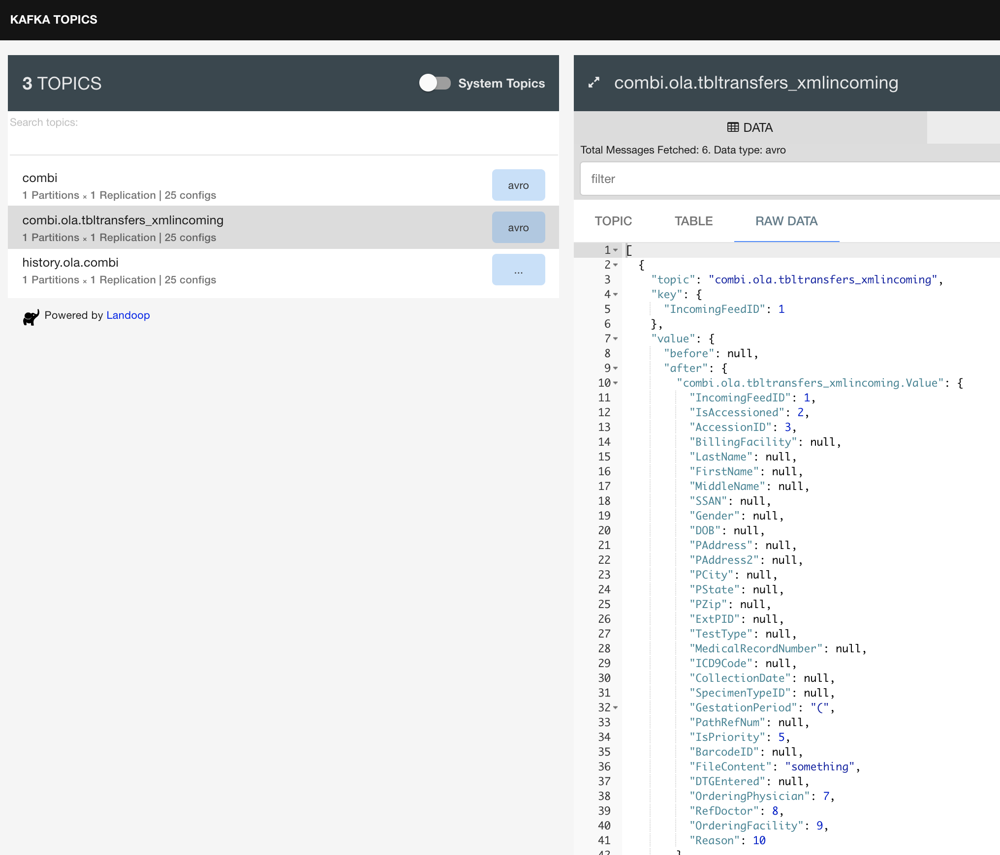
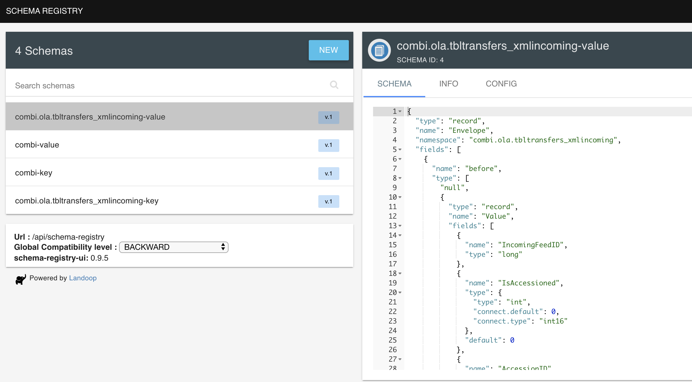

## Getting Started Avro Schema and Debezium


[Apache Avro](https://avro.apache.org/) is a data serialization system. More verbosely,

> Avro is a row-oriented remote procedure call and data serialization framework developed within Apache's Hadoop project. It uses JSON for defining data types and protocols, and serializes data in a compact binary format

Avro provides:

* Rich data structures.
* A compact, fast, binary data format.
* A container file, to store persistent data.
* Remote procedure call (RPC).
* Simple integration with dynamic languages. Code generation is not required to read or write data files nor to use or implement RPC protocols. Code generation as an optional optimization, only worth implementing for statically typed languages.

*Source: [quickstart](https://github.com/phunt/avro-rpc-quickstart#whats-apache-avro)*

[Debezium](https://debezium.io/) is a change data capture implementation that:

> Debezium is an open source distributed platform for change data capture. Start it up, point it at your databases, and your apps can start responding to all of the inserts, updates, and deletes that other apps commit to your databases. Debezium is durable and fast, so your apps can respond quickly and never miss an event, even when things go wrong.

## Building an Avro Schema Example

Let's start by building an avro schema by hand, and then generating the resulting classes for use. For this setup, we'll use tutorials point [site](https://www.tutorialspoint.com/avro/avro_schemas.htm)

```json
{
   "type" : "record",
   "namespace" : "com.jstone28.winch",
   "name" : "Employee",
   "fields" : [
      { "name" : "message" , "type" : "string" },
   ]
}
```

`type` - primitive or derived type; "record" indicates
`namespace` - the namespace where the object resides
`name` - combined with the namespace it defines the identifier for object; when in a field, it services as the name of the nested object
`fields` - holds the JSON data for the object

The [specification](https://avro.apache.org/docs/current/spec.html) provides an excellent resource.

## Automatically Generating Objects

As someone who does not come from the JVM world, the plugin system and automagical process that author these generated objects are still a mystery to me. I will, one day, dig into the source of the gradle plugin system and the respective avro plugins to track down how this all gets put together but I'll save that for another blog. For now, we can add the following to the `build.gradle.kts` and `settings.gradle.kts` to have access to the generated object at the classpath represented by the namespace and name of record.

For example:

`build.gradle.kts`

```kotlin
plugins {
   id("com.commercehub.gradle.plugin.avro") version "0.16.0"
}

repositories {
   mavenCentral()
   maven(url = "https://packages.confluent.io/maven/")
}

dependencies {
   implementation("io.confluent:kafka-avro-serializer:5.2.1")
   implementation("io.confluent:kafka-schema-registry-client:5.3.0")
   implementation("org.apache.avro:avro:1.8.2")
}
```

`settings.gradle.kts`

```kotlin
pluginManagement {
    repositories {
            jcenter()
            gradlePluginPortal()
            maven(url = "https://dl.bintray.com/gradle/gradle-plugins")
    }
}
```

## Streaming Database Changes with Debezium

In the past, we've setup Debezium to stream data changes in the [MySQL](./kotlinconsumer.md) and [PostgreSQL](./debezium.md) database. Today, we'll use it to inspect the message being produced by the Debezium connector, and pushed into Kafka for consumption.



By default, Debezium uses Avro binary data format and schema. Using a project like [fast-data-dev](https://github.com/lensesio/fast-data-dev) you can quickly visualize these items.


