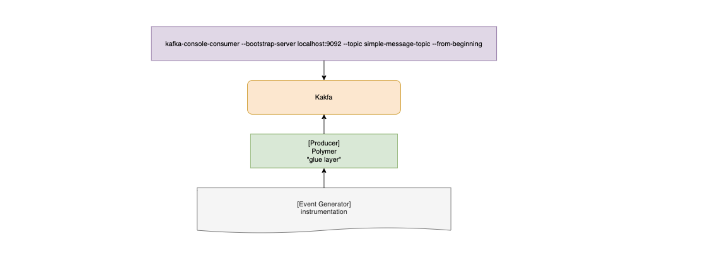
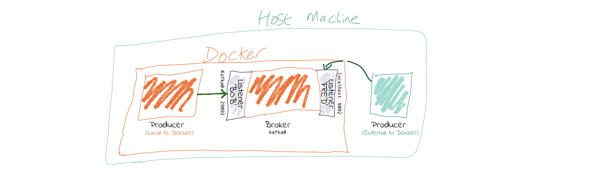

# Docker Compose, Kotlin, and Kafka: Why Can't I Connect


Building a simple docker-compose environment to test docker environments is the bread and butter of application development. It's usually the first step in unifying development amongst a team of engineers. This week, I had to do just this very thing for a PoC I was developing. [Polymer](https://gitlab.com/jstone28/polymer) was the outcome of the effort.

The general idea behind the PoC is creating a "translation layer" between an application firing events ([instrumentation](https://gitlab.com/jstone28/instrumentation)) and an instance of kafka running a consumer watching a single topic. A visual representation of this architecture looks like this:



## The Problem

```bash
Connection to node -1 (localhost/127.0.0.1:9092) could not be established. Broker may not be available. (org.apache.kafka.clients.NetworkClient)
```

There seems to be an inability to access Kafka from any other application on the docker generated network. Here's our starting `docker-compose.yml`

```yaml
version: "3.1"

services:
  zookeeper:
    container_name: zookeeper
    image: confluent/zookeeper
    ports:
      - 2181:2181
      - 2888:2888
      - 3888:3888

  kafka:
    image: debezium/kafka:1.0
    container_name: kafka
    hostname: kafka
    ports:
     - 9092:9092
    environment:
      KAFKA_ADVERTISED_LISTENERS: PLAINTEXT://0.0.0.0:9092
      KAFKA_LISTENERS: PLAINTEXT://0.0.0.0:9092
      ZOOKEEPER_CONNECT: zookeeper:2181
    volumes:
      - /var/run/docker.sock:/var/run/docker.sock
    depends_on:
      - zookeeper

  polymer:
    build:
      context: .
      dockerfile: ./Dockerfile
    container_name: polymer
    ports:
      - 8080:8080
    depends_on:
      - kafka

  instrumentation:
    image: registry.gitlab.com/jstone28/instrumentation
    container_name: instrumentation
    depends_on:
      - polymer
```

Our end to end flow is to have `instrumentation` call into `polymer` which will then publish the event to a Kafka topic (`simple-message-topic`). This mimics a board scope of use cases, but it's really meant to exercise `polymer`, to ensure a translation layer can be built and maintained.

To get things rolling, Let's start up Kafka and Zookeeper (kafka is dependent on zookeeper so calling up on kafka will result in both coming up)

```bash
docker-compose up kafka
```

Next, let's open a new shell and open a consumer via the kafka shell scripts watching the topic: `simple-message-topic`

```bash
docker-compose exec kafka /kafka/bin/kafka-console-consumer.sh --bootstrap-server kafka:9092 --topic simple-message-topic --from-beginning
```

Once this is open, we should see the consumer shell spit out:

```bash
[2020-02-15 21:15:09,477] WARN [Consumer clientId=consumer-console-consumer-49289-1, groupId=console-consumer-49289] Error while fetching metadata with correlation id 2 : {simple-message-topic=LEADER_NOT_AVAILABLE} (org.apache.kafka.clients.NetworkClient)
```

Now that we have a consumer setup, let's open up another shell and start firing events. Start Up `Polymer`

```bash
docker-compose up polymer
```

We can have `instrumentation` fire events to polymer or we can kick them off manually by making a `POST` request through [POSTMAN](https://docs.api.getpostman.com/?version=latest) with a JSON body. In our case we're using:

```json
{
    "message": "simple-message-message"
}
```

If you attempt that `POST` request now, you'll see and endless stream of the following logs in the `Polymer` output:

```bash
polymer| 2020-02-15 21:22:23.673 INFO 90 --- [main] c.jstone28.polymer.PolymerApplicationKt: Started PolymerApplicationKt in 3.416 seconds (JVM running for 4.06)
```

So what's going on here? Let's pull an image from Robin Moffatt's [blog](https://rmoff.net/2018/08/02/kafka-listeners-explained/)



This helps pull together some ideas. There's another line in the blog that points out something I've been overlooking:

> LISTENERS are what interfaces Kafka binds to. ADVERTISED_LISTENERS are how clients can connect.

That statement, more or less, points out what I've been overlooking. I don't understand Kafka well enough. I am arbitrarily setting environment variables and hoping that it works. Time to do some reading.

Let's go at this from the other side, we know that the Springboot module instantiating kafka is trying to do so at `localhost`. Instead, let's update the configuration to point to `kafka:9092`. Before now, I didn't know about `resource/application.yml` or `resource/application.properties` but this solved the issue.

```yaml
spring:
   kafka:
     producer:
        bootstrap-servers: kafka:9092
        key-serializer: org.apache.kafka.common.serialization.StringSerializer
        value-serializer: org.apache.kafka.common.serialization.StringSerializer
```

And because we solved it from the Springboot module's perspective, we can revert the original `docker-compose.yml`

```yaml
version: "3.1"

services:
  zookeeper:
    container_name: zookeeper
    image: confluent/zookeeper
    ports:
      - 2181:2181
      - 2888:2888
      - 3888:3888

  kafka:
    image: debezium/kafka:1.0
    container_name: kafka
    hostname: kafka
    ports:
     - 9092:9092
    environment:
      ZOOKEEPER_CONNECT: zookeeper:2181
    volumes:
      - /var/run/docker.sock:/var/run/docker.sock
    depends_on:
      - zookeeper

  polymer:
    build:
      context: .
      dockerfile: ./Dockerfile
    container_name: polymer
    ports:
      - 8080:8080
    depends_on:
      - kafka

  instrumentation:
    image: registry.gitlab.com/jstone28/instrumentation
    container_name: instrumentation
    depends_on:
      - polymer
```

*Note that we reduced the number of kafka environment variable*


Now, when we send a message with a `POST`, we can see the consumer echo:

```json
{
    "message": "simple-message-message"
}
```
