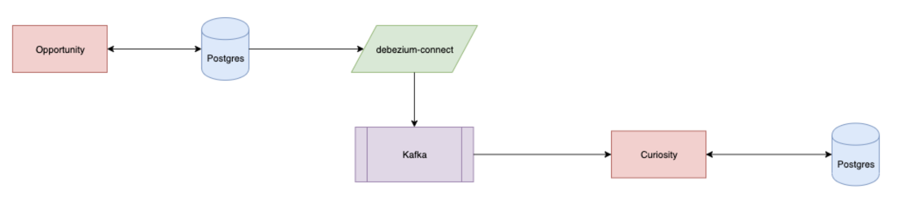

# Change Data Capture with Debezium, Kafka, Postgres, and Golang


[Debezium](https://debezium.io/documentation/faq/) Is a tool used to handle change data capture (CDC). You can think of CDC as an event system for your database. Debezium works by hooking into Postgres' Write Ahead Logs (WAL) to capture events. It ties itself together with a encode/unencode library to publish json messages to a Kafka topic.

Last week I created a PoC to test how consuming debezium messages from a kafka might translate into and end to end application. I'm sad to report that I wasn't able to entirely complete it (and likely won't) because it became obvious 5/6ths the way through that the remaining logic was going to make this PoC intractable against its contenders.

## Overview



The purpose of the PoC was to determine if debezium was an appropriate solution for handling interim migration from one database to another database instance by following the events occurring in one database and populating the other with those same events.

The project breaks down into two separate repos. One for a producer, [opportunity-rover](https://gitlab.com/jstone28/opportunity-rover); and one for the consumer of those messages, [curiosity-rover](https://gitlab.com/jstone28/curiosity-rover). Opportunity house all of the plumbing in terms of docker-compose environments and general setup. The [Opportunity README](https://gitlab.com/jstone28/opportunity-rover/blob/master/README.md) defines how to get started, but spoiler: you clone and run `./startup`

The process that gets kicked off does the following:

1. Starts up Postgres, Kafka, Zookeeper, Debezium (connect), Opportunity, and finally Curiosity.
2. It then makes a curl call with the debezium information into Kafka's [Connector](https://docs.confluent.io/current/connect/managing/index.html) feature
3. A terminal is opened within kafka to watch messages coming through on the topic specified by the connector
4. Curiosity has already begun watching on that same topic mimicking a consumer ready to push the messages into its own database
5. A User can make a call to `localhost:3030/insert` which will prompt a `username` record insert

## Outcome

The result of the PoC was abandonment.

The reason for the abandonment came when we started looking at how the messages were displayed on the topic. For example:

```json
Message: {"schema":{"type":"struct","fields":[{"type":"struct","fields":[{"type":"string","optional":true,"field":"username"}],"optional":true,"name":"postgres.public.opportunity.Value","field":"before"},{"type":"struct","fields":[{"type":"string","optional":true,"field":"username"}],"optional":true,"name":"postgres.public.opportunity.Value","field":"after"},{"type":"struct","fields":[{"type":"string","optional":false,"field":"version"},{"type":"string","optional":false,"field":"connector"},{"type":"string","optional":false,"field":"name"},{"type":"int64","optional":false,"field":"ts_ms"},{"type":"string","optional":true,"name":"io.debezium.data.Enum","version":1,"parameters":{"allowed":"true,last,false"},"default":"false","field":"snapshot"},{"type":"string","optional":false,"field":"db"},{"type":"string","optional":false,"field":"schema"},{"type":"string","optional":false,"field":"table"},{"type":"int64","optional":true,"field":"txId"},{"type":"int64","optional":true,"field":"lsn"},{"type":"int64","optional":true,"field":"xmin"}],"optional":false,"name":"io.debezium.connector.postgresql.Source","field":"source"},{"type":"string","optional":false,"field":"op"},{"type":"int64","optional":true,"field":"ts_ms"}],"optional":false,"name":"postgres.public.opportunity.Envelope"},"payload":{"before":null,"after":{"username":"user-0.4809437189067354"},"source":{"version":"1.0.0.Final","connector":"postgresql","name":"postgres","ts_ms":1579630649193,"snapshot":"false","db":"opportunity","schema":"public","table":"opportunity","txId":494,"lsn":23433960,"xmin":null},"op":"c","ts_ms":1579630649195}}
```

This is the message outputted by debezium and left for consumption by Curiosity. We quickly realized that the logic required to translate this message into a sql statement and (possibly) subsequent API calls was going to be an insurmountable amount against just doing a traditional double-write-with-snapshot effort.

Overall it was fairly straight forward save for using kafka with docker containers. Docker for mac does some spooky stuff with localhost, which I could never get really figured out. I broke down and ran everything within the docker-compose network, and there everything was accessible.
