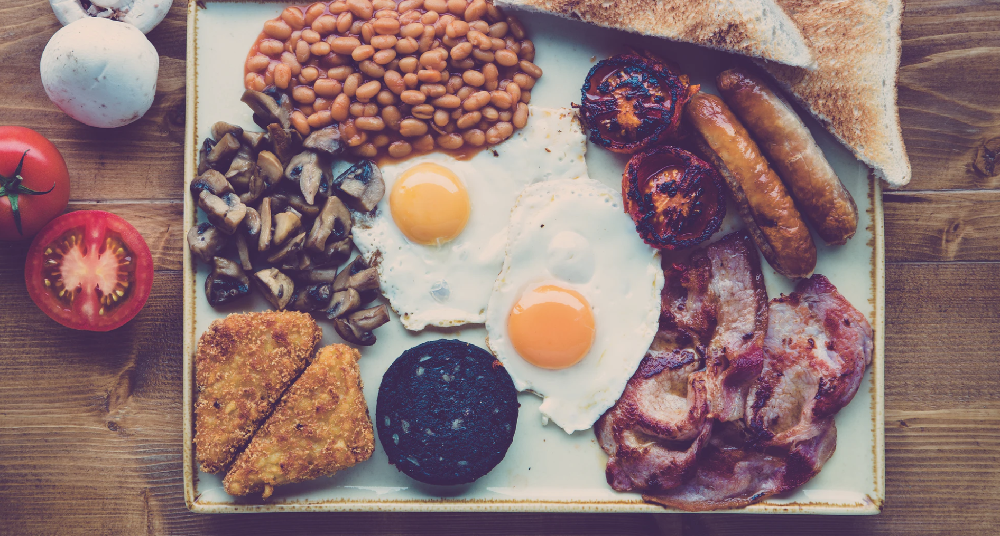

# What an IHOP Can Teach About Team Culture

**What can an IHOP teach us about team dynamics and team culture?** *A lot, actually.*

This entry isn't so much a technical view of the Dine Brand Global group, but rather an observation about watching other teams, outside software development react to the same or similar problems.

We spend a great deal of time, as engineers, trying to justify why our team problems are more complicated, more difficult than other industries but the fact remains: if you remove software from the equation, you can easily boil down all problems to the same set that every team deals with.

***

I'm seated in the same seat as last time though that makes sense because last time I was here it was roughly the same time. This IHOP, near my home, is always buzzing. It's an odd blend of a parking lot that's too small, a restaurant built in the 70s that's always nearly full, and a busy road to tie it all together. Every time I'm in this IHOP, I feel like I'm a part of a well rehearsed play.

The kitchen is at the center of this IHOP -- a nervous system of sorts. If you look closely, the cooks actually set the pace for the restaurant. Walk into a poorly run franchise and you'll notice the cadence of the kitchen isn't quite right. It's like a band trying to keep pace with a drummer who's not keeping tempo. This is fundamentally important to the IHOP team. Namely, that both ends of the process, input and output, function as efficiently as possible. Food cannot sit idle so, if the kitchen is producing, the waitstaff has to be moving quickly. Perhaps it's breakfast foods that lend itself well to this paradigm or the simple nature of the foods on the IHOP menus, however, because the pace is also set quite high, there's little time for the waitstaff to do anything else besides be 100% engaged; idle hands, as they say.

If you look at this from both perspectives: the kitchen is the heartbeat. The waitstaff is the blood coursing through the body. The waitstaff collects the orders, and hands them to the cooks, the cooks in turn (and moving as efficiently as possible), return the completed orders. The waiters, conscious of idle finished food, rush to return the now completed orders to their respective customers whilst also inputting new orders. The pace is self feeding, it's self referential. The cooks move fast because the waitstaff is moving fast and the waitstaff moves quickly because of the cooks.

Pace is so very important to team culture and team dynamics but it's often overlooked. As a leader, if someone is telling you to slow down, your response shouldn't be to slow down. It should be to find people who can keep up with your pace. And, if your mind isn't flooded with ideas of potentiality, in all likelihood you're working too slow; however, this is of less focus because the market will inform you of your failings just the same.

The short 5 minute wait before my food arrives is punctuated by our polite and skillful waitress keeping a vigilant eye over mine and all the tables in her section. This particular waitress is well into her 50s but I've also had the waiter one section over and the one working the back section too. It's odd to see such uniformity in action without direct communication: you get the same service whether it's here or there, this waiter or that waitress. For the moment, I'm captivated by our waitress, finding herself a free moment, recleaning and readjusting chairs and tables in the next section over.

The idea that sits just below the surface at every IHOP is the idea of decision autonomy. Every person is given complete control over their domain. They act and react to events as they see fit; and because this same decision autonomy exists at every level, it overlays itself creating a military-like precision of leadership. This is a fundamental ingredient to every successful team because it doesn't just persist in the here and now but extends over time; meaning all new members to the team are instantly indoctrinated, and thus carry on the culture as it's imparted on them.

That's enough for now. I'm going to finish my food and get out of here. I've got pace to keep. /J

[Home](../index.md)
