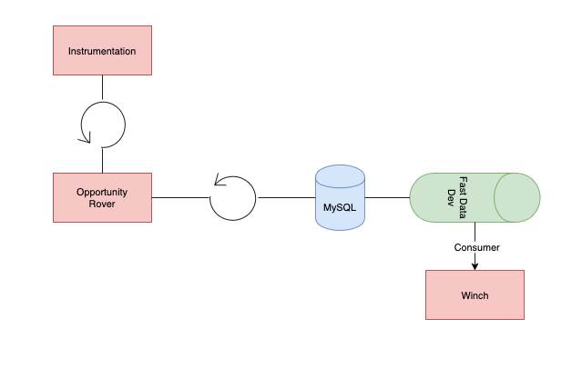
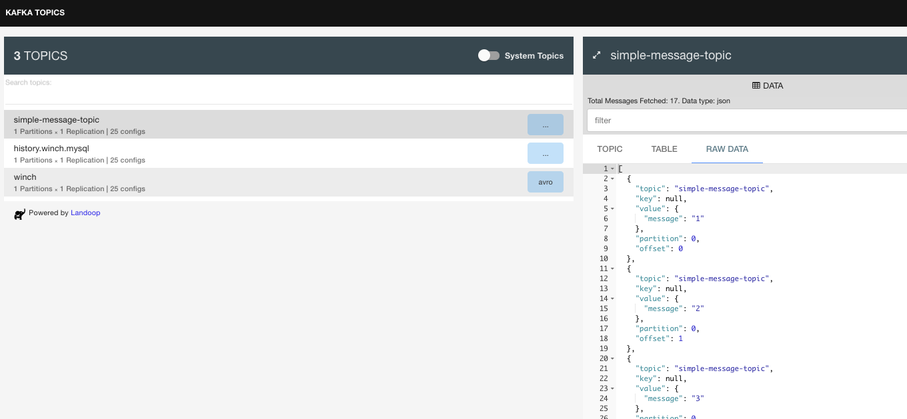
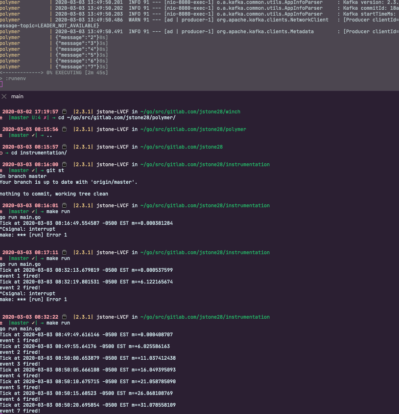

## Creating a Kafka Consumer with Kafka, Kotlin, PostgreSQL, and Debezium

Continuing with tools of the trade, we're going to explore writing a Consumer for a Kafka topic in Kotlin. We'll generate these messages with debezium via an http endpoint so that the process will be end to end. Lucky for us, we can build on some of what we've already been working on to implement this solution.

We'll do our work in the [winch project](https://gitlab.com/jstone28/winch)

### What's Required

* [Polymer](https://gitlab.com/jstone28/polymer)
* [Instrumentation](https://gitlab.com/jstone28/instrumentation)
* [Fast Data Dev](https://hub.docker.com/r/landoop/fast-data-dev)
* [Avro Schema](https://avro.apache.org/docs/current/spec.html)
* [Winch](https://gitlab.com/jstone28/winch) Our kotlin test application

## Overview



We'll setup instrumentation and polymer to send a continuous flow of messages into fast-data-dev (kafka) where we can consume them by winch and print "received!" when we get a new message

## Getting Started

Let's make sure we can get messages into fast-data-dev in an automated fashion first.

```bash
./scripts/startup
```

This should start up all required containers and register the debezium connector with kafka-fast-data-dev. Now e can navigate to `localhost:3030` and check the connector-ui to make sure we've registered correctly.



Now that we've verified the connector's attached correctly. Let's move on to kicking off instrumentation with polymer.

```bash
./gradlew runenv
```

To get the most control out of our test environment, we'll run instrumentation locally. To do this, clone instrumentation and run the following command from the root directory:

```bash
make run
```



Ok now we can see message generated by instrumentation via polymer, next we can move to actually writing the consumer. We're going to start with the most simple and straight forward example from around the internet. Using [this](https://www.confluent.io/blog/apache-kafka-spring-boot-application/) blog post from the guys over at [confluent](https://www.confluent.io/) to get started:

We create a service to consume the `simple-message-topic` message

```kotlin
package com.jstone28.winch.services

import org.springframework.kafka.annotation.KafkaListener;
import org.springframework.stereotype.Service;

@Service
class SimpleMessageTopicConsumer {

    @KafkaListener(topics = ["simple-message-topic"], groupId = "group_id")
    fun processMessage(message: String) {
        println("got message:" + message)
    }

}
```

* `@Service` - "an operation offered as an interface that stands alone in the model, with no encapsulated state" (Evans, 2003); also a specialization of `@Component` allowing for implementation classes to be autodetected through classpath scanning
* `SimpleMessageTopicConsumer` - name of class
* `@KafkaListener` - "Annotation that marks a method to be the target of a Kafka message listener on the specified topics." [Springboot docs](https://docs.spring.io/spring-kafka/api/org/springframework/kafka/annotation/KafkaListener.html#groupId--)
* `topic` - the topic for which the `KafkaListener` should listen for.
* `groupId` - override default `group.id` property for the consumer factory of this value for this listener only
* `processMessage` name of our function

With this consumer, we can take advantage of the built-in springboot functionality to process message found


