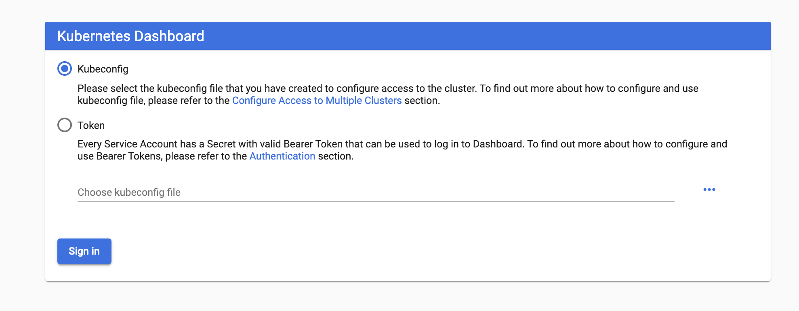

# [Pt 1] Installing and Configuring the Kubernetes Dashboard with Kind


This [process](https://kubernetes.io/docs/tasks/access-application-cluster/web-ui-dashboard/) has been well documented by the various Kubernetes teams. My overview is basically replicant with details that I deem valuable. Under no circumstances is this a *definitive guide*

[Kind](https://github.com/kubernetes-sigs/kind) is Kubernetes in Docker and it's a great alternative to using a cloud provider for a quick and dirty kubernetes instance. There are, of course, some shortcomings with using kind but they're not going to impede us in our quest to install and configure the kubernetes dahsboard.

Kubernetes [Dashboard](https://kubernetes.io/docs/tasks/access-application-cluster/web-ui-dashboard/#deploying-containerized-applications) is a Web User Interface for a Kubernetes cluster. It has long been controversial because of its proneness to vulnerabilities.

In this blog, we're going to install, lock down, and configure the Kubernetes.

## Getting Started

Let's start by creating a kind cluster. If you don't have kind installed, you can install it with brew:

```bash
brew install kind
```

Next let's start up a new cluster

```bash
kind create cluster
```

And then we'll point our kubeconfig at the newly created cluster

```bash
export KUBECONFIG="$(kind get kubeconfig-path --name="kind")"
```

Great, now we have a kind cluster and we're ready to get installing

## Installation

To deploy the Kubernetes dashboard (not enabled by default), we'll apply yaml from the Kubernetes project itself

```bash
kubectl apply -f https://raw.githubusercontent.com/kubernetes/dashboard/v2.0.0-beta8/aio/deploy/recommended.yaml
```

This yaml can be found at the [URL](https://raw.githubusercontent.com/kubernetes/dashboard/v2.0.0-beta8/aio/deploy/recommended.yaml) listed above. Let's quickly breakdown what's being installed:

Create a new [Namespace](https://kubernetes.io/docs/concepts/overview/working-with-objects/namespaces/) called `kubernetes-dashboard`

```yaml
apiVersion: v1
kind: Namespace
metadata:
  name: kubernetes-dashboard
```

Create a [Service Account](https://kubernetes.io/docs/reference/access-authn-authz/service-accounts-admin/) in the newly create `kubernetes-dashboard` namespace called `kubernetes-dashboard`

```yaml
apiVersion: v1
kind: ServiceAccount
metadata:
  labels:
    k8s-app: kubernetes-dashboard
  name: kubernetes-dashboard
  namespace: kubernetes-dashboard
```

Create a new [Service](https://kubernetes.io/docs/concepts/services-networking/service/) for the dashboard using a [clusterIP](https://kubernetes.io/docs/concepts/services-networking/service/#publishing-services-service-types) type (IP only available within the cluster)

```yaml
kind: Service
apiVersion: v1
metadata:
  labels:
    k8s-app: kubernetes-dashboard
  name: kubernetes-dashboard
  namespace: kubernetes-dashboard
spec:
  ports:
    - port: 443
      targetPort: 8443
  selector:
    k8s-app: kubernetes-dashboard
```

Next we create three [Secrets](https://kubernetes.io/docs/concepts/configuration/secret/) and a [ConfigMap](https://kubernetes.io/docs/tasks/configure-pod-container/configure-pod-configmap/). Our secretes are listed as `opaque` meaning they can be arbitrary sets of key value pairs. The secrets define `kubernetes-dashboard-certs`, `kubernetes-dashboard-csrf`, and `kubernetes-dashboard-key-holder` respectively. The ConfigMap simply defines an empty map of `kubernetes-dashboard-settings`. We'll explore what these are later in the configuration section.

```yaml
---

apiVersion: v1
kind: Secret
metadata:
  labels:
    k8s-app: kubernetes-dashboard
  name: kubernetes-dashboard-certs
  namespace: kubernetes-dashboard
type: Opaque

---

apiVersion: v1
kind: Secret
metadata:
  labels:
    k8s-app: kubernetes-dashboard
  name: kubernetes-dashboard-csrf
  namespace: kubernetes-dashboard
type: Opaque
data:
  csrf: ""

---

apiVersion: v1
kind: Secret
metadata:
  labels:
    k8s-app: kubernetes-dashboard
  name: kubernetes-dashboard-key-holder
  namespace: kubernetes-dashboard
type: Opaque

---

kind: ConfigMap
apiVersion: v1
metadata:
  labels:
    k8s-app: kubernetes-dashboard
  name: kubernetes-dashboard-settings
  namespace: kubernetes-dashboard
```

Create a [Role](https://kubernetes.io/docs/reference/access-authn-authz/rbac/#default-roles-and-role-bindings) for in cluster RBAC best practices

```yaml
kind: Role
apiVersion: rbac.authorization.k8s.io/v1
metadata:
  labels:
    k8s-app: kubernetes-dashboard
  name: kubernetes-dashboard
  namespace: kubernetes-dashboard
rules:
  # Allow Dashboard to get, update and delete Dashboard exclusive secrets.
  - apiGroups: [""]
    resources: ["secrets"]
    resourceNames: ["kubernetes-dashboard-key-holder", "kubernetes-dashboard-certs", "kubernetes-dashboard-csrf"]
    verbs: ["get", "update", "delete"]
    # Allow Dashboard to get and update 'kubernetes-dashboard-settings' config map.
  - apiGroups: [""]
    resources: ["configmaps"]
    resourceNames: ["kubernetes-dashboard-settings"]
    verbs: ["get", "update"]
    # Allow Dashboard to get metrics.
  - apiGroups: [""]
    resources: ["services"]
    resourceNames: ["heapster", "dashboard-metrics-scraper"]
    verbs: ["proxy"]
  - apiGroups: [""]
    resources: ["services/proxy"]
    resourceNames: ["heapster", "http:heapster:", "https:heapster:", "dashboard-metrics-scraper", "http:dashboard-metrics-scraper"]
    verbs: ["get"]
```

Create a [ClusterRole](https://kubernetes.io/docs/reference/access-authn-authz/rbac/) which gives the dashboard access to all namespaces

```yaml
kind: ClusterRole
apiVersion: rbac.authorization.k8s.io/v1
metadata:
  labels:
    k8s-app: kubernetes-dashboard
  name: kubernetes-dashboard
rules:
  # Allow Metrics Scraper to get metrics from the Metrics server
  - apiGroups: ["metrics.k8s.io"]
    resources: ["pods", "nodes"]
    verbs: ["get", "list", "watch"]
```

Next, create the [RoleBinding](https://kubernetes.io/docs/reference/access-authn-authz/rbac/#rolebinding-and-clusterrolebinding) for our [Service Account](https://kubernetes.io/docs/reference/access-authn-authz/rbac/) and [ClusterRole](https://kubernetes.io/docs/reference/access-authn-authz/rbac/)

```yaml
---

apiVersion: rbac.authorization.k8s.io/v1
kind: RoleBinding
metadata:
  labels:
    k8s-app: kubernetes-dashboard
  name: kubernetes-dashboard
  namespace: kubernetes-dashboard
roleRef:
  apiGroup: rbac.authorization.k8s.io
  kind: Role
  name: kubernetes-dashboard
subjects:
  - kind: ServiceAccount
    name: kubernetes-dashboard
    namespace: kubernetes-dashboard

---

apiVersion: rbac.authorization.k8s.io/v1
kind: ClusterRoleBinding
metadata:
  name: kubernetes-dashboard
roleRef:
  apiGroup: rbac.authorization.k8s.io
  kind: ClusterRole
  name: kubernetes-dashboard
subjects:
  - kind: ServiceAccount
    name: kubernetes-dashboard
    namespace: kubernetes-dashboard
```

Finally, we arrive at the dashabord [Deployment](https://kubernetes.io/docs/concepts/workloads/controllers/deployment/). This is the piece that actually deploys our dashboard.

```yaml

kind: Deployment
apiVersion: apps/v1
metadata:
  labels:
    k8s-app: kubernetes-dashboard
  name: kubernetes-dashboard
  namespace: kubernetes-dashboard
spec:
  replicas: 1
  revisionHistoryLimit: 10
  selector:
    matchLabels:
      k8s-app: kubernetes-dashboard
  template:
    metadata:
      labels:
        k8s-app: kubernetes-dashboard
    spec:
      containers:
        - name: kubernetes-dashboard
          image: kubernetesui/dashboard:v2.0.0-beta8
          imagePullPolicy: Always
          ports:
            - containerPort: 8443
              protocol: TCP
          args:
            - --auto-generate-certificates
            - --namespace=kubernetes-dashboard
            # Uncomment the following line to manually specify Kubernetes API server Host
            # If not specified, Dashboard will attempt to auto discover the API server and connect
            # to it. Uncomment only if the default does not work.
            # - --apiserver-host=http://my-address:port
          volumeMounts:
            - name: kubernetes-dashboard-certs
              mountPath: /certs
              # Create on-disk volume to store exec logs
            - mountPath: /tmp
              name: tmp-volume
          livenessProbe:
            httpGet:
              scheme: HTTPS
              path: /
              port: 8443
            initialDelaySeconds: 30
            timeoutSeconds: 30
          securityContext:
            allowPrivilegeEscalation: false
            readOnlyRootFilesystem: true
            runAsUser: 1001
            runAsGroup: 2001
      volumes:
        - name: kubernetes-dashboard-certs
          secret:
            secretName: kubernetes-dashboard-certs
        - name: tmp-volume
          emptyDir: {}
      serviceAccountName: kubernetes-dashboard
      nodeSelector:
        "beta.kubernetes.io/os": linux
      # Comment the following tolerations if Dashboard must not be deployed on master
      tolerations:
        - key: node-role.kubernetes.io/master
          effect: NoSchedule
```

The Installation doesn't leave us shorthanded. As its last two items, it provides a metrics scrapper and metrics dashboard for monitoring the cluster and dashboard.

```yaml
kind: Service
apiVersion: v1
metadata:
  labels:
    k8s-app: dashboard-metrics-scraper
  name: dashboard-metrics-scraper
  namespace: kubernetes-dashboard
spec:
  ports:
    - port: 8000
      targetPort: 8000
  selector:
    k8s-app: dashboard-metrics-scraper

---

kind: Deployment
apiVersion: apps/v1
metadata:
  labels:
    k8s-app: dashboard-metrics-scraper
  name: dashboard-metrics-scraper
  namespace: kubernetes-dashboard
spec:
  replicas: 1
  revisionHistoryLimit: 10
  selector:
    matchLabels:
      k8s-app: dashboard-metrics-scraper
  template:
    metadata:
      labels:
        k8s-app: dashboard-metrics-scraper
      annotations:
        seccomp.security.alpha.kubernetes.io/pod: 'runtime/default'
    spec:
      containers:
        - name: dashboard-metrics-scraper
          image: kubernetesui/metrics-scraper:v1.0.1
          ports:
            - containerPort: 8000
              protocol: TCP
          livenessProbe:
            httpGet:
              scheme: HTTP
              path: /
              port: 8000
            initialDelaySeconds: 30
            timeoutSeconds: 30
          volumeMounts:
          - mountPath: /tmp
            name: tmp-volume
          securityContext:
            allowPrivilegeEscalation: false
            readOnlyRootFilesystem: true
            runAsUser: 1001
            runAsGroup: 2001
      serviceAccountName: kubernetes-dashboard
      nodeSelector:
        "beta.kubernetes.io/os": linux
      # Comment the following tolerations if Dashboard must not be deployed on master
      tolerations:
        - key: node-role.kubernetes.io/master
          effect: NoSchedule
      volumes:
        - name: tmp-volume
          emptyDir: {}
```

After applying these manifests, you should see the following outputted in the CLI

```bash
$→ kubectl apply -f https://raw.githubusercontent.com/kubernetes/dashboard/v2.0.0-beta8/aio/deploy/recommended.yaml
namespace/kubernetes-dashboard created
serviceaccount/kubernetes-dashboard created
service/kubernetes-dashboard created
secret/kubernetes-dashboard-certs created
secret/kubernetes-dashboard-csrf created
secret/kubernetes-dashboard-key-holder created
configmap/kubernetes-dashboard-settings created
role.rbac.authorization.k8s.io/kubernetes-dashboard created
clusterrole.rbac.authorization.k8s.io/kubernetes-dashboard created
rolebinding.rbac.authorization.k8s.io/kubernetes-dashboard created
clusterrolebinding.rbac.authorization.k8s.io/kubernetes-dashboard created
deployment.apps/kubernetes-dashboard created
service/dashboard-metrics-scraper created
deployment.apps/dashboard-metrics-scraper created
```

We can attach to the dashboard by creating a proxy into the cluster. Kubectl handles all the plumbing, and gives us a nice window on our own `localhost` into the cluster.

```bash
kubectl proxy
```

The dashboard will be available after the proxy is created at: `http://localhost:8001/api/v1/namespaces/kubernetes-dashboard/services/https:kubernetes-dashboard:/proxy/`



Let's get started with the Service Accounts Bearer Token

```bash
kubectl -n kube-system describe secret $(
  kubectl -n kube-system get secret | \
  awk '/^deployment-controller-token-/{print $1}'
) | \
awk '$1=="token:"{print $2}'
```

## Installing an App

Let's get started by deploying an application on to our cluster so we can see things move around on the dashboard. A good place to start is with [kuard](https://github.com/kubernetes-up-and-running/kuard).

```bash
kubectl run --restart=Never --image=gcr.io/kuar-demo/kuard-amd64:blue kuard
kubectl port-forward kuard 8080:8080
```

Now let's switch back to the dashboard

```bash
http://localhost:8001/api/v1/namespaces/kubernetes-dashboard/services/https:kubernetes-dashboard:/proxy/
```

We can see the pod that's been spun up for kaurd


From here we can mess with Kuard's features to simulate different use cases within the cluster


## Conclusion

We'll follow up in [Part 2](pt2-k8s-dashboard.md) configuring the dashboard.
