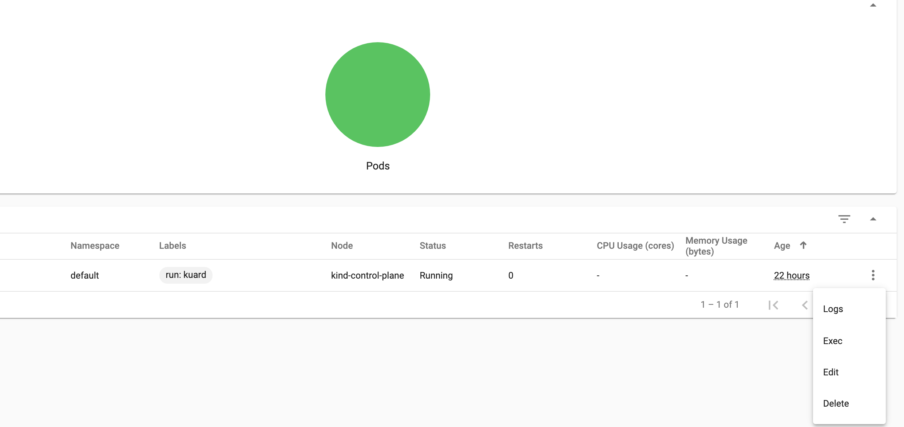

# [Pt 2] Installing and Configuring the Kubernetes Dashboard with Kind

In [Part 1](./pt1-k8s-dashboard.md) we got a Kubernetes Dashboard up and running along side a small application called [kuard](https://github.com/kubernetes-up-and-running/kuard) to visualize what was happening in the cluster. In this post we'll explore the best practices when working with the Kubernetes Dashboard.

Before getting on, I would be remiss not to mention a blog post by Joe Beda on the topic of the [Kubernetes Dashboard](https://blog.heptio.com/on-securing-the-kubernetes-dashboard-16b09b1b7aca). He goes in depth on the different aspects of configuring the dashboard and the "gotchas" associated with lenient security practices. There was also an excellent [TGIK](https://www.youtube.com/watch?v=od8TnIvuADg) also done by Joe Beda covering this topic.

## Authentication and the Kubernetes Dashboard

Before we discuss any sort of authentication pattern, we should first and foremost declare that the Kubernetes Dashboard *should never be exposed outside the cluster.* Only those with cluster access, should be able to reach the dashboard.

Authentication with the Kubernetes Dashboard can be handled in many ways. The two that were given at log in is via kubeconfig, and the second by token. The kubeconfig is available (by default) in the home directory usually under the `~/.kube/config` path. The token can be acquired by searching the secret associated with the service account used to access the cluster. The kubernetes dashboard does integration with `OIDC` which means github, google, facebook, and other auth providers can be configured to accept or deny user access. How to handle authentication is up to your organization, and since the early days of the dashboard, there have been many improvements to its security. Just remember the golden rule: *never, ever open access to the dashboard outside the cluster.*

## General Usage

I won't go to deeply here since how you use the dashboard is entirely up to you, however, I will point out a feature that I'm sure you're interested in. That is, in pod `exec`.

Before we start, I should mention a trend I've seen amongst new Kubernetes users; that trend is the wanting to treat Kubernetes as a set of servers rather than a general pool of resources. Because of this perspective, new Kubernetes users tend to want to log into every pod and execute actions there. This is not an advisable technique because pods are ephemeral. You can expect them to be destroyed and recreated at a feverish pace. Changes must be made at the infrastructure (infrastructure as code) level so that they continue as pods and nodes are created and destroyed.

This feature is protected by RBAC service accounts so be sure that you have the correct access before attempting to run commands in the pod.

## Conclusion

The Kubernetes Dashboard is an interesting tool that is easy enough to deploy and grok. But, like most things in the Kubernetes world, if you're looking for something specific, you should probably find and deploy something specific. All that having been said, if you're only looking for general information about your cluster, look no further than the Kubernetes Dashboard.
