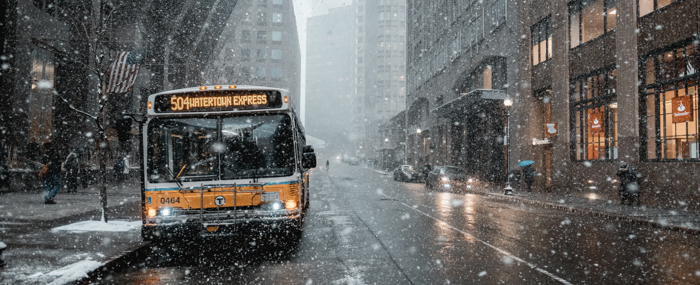

# What Weather Forecasts Tell Us About Progress and Technology

I was sitting next to the fire listening to the rain when it struck me: weather forecasts seem to be getting less and less accurate. In fact, even the most popular of applications is occasionally 10+ degrees wrong. It runs contradictory to what seems intuitive; there are clearly more satellites, more organizations, more people looking at the skies than ever before. How could that contribute to a less accurate report?

The answer lies in a couple of factors:

* Too much data (Signal v. Noise)
* The need to grab the headline
* The fear of being wrong (or unprepared)

## Too Much Data (Signal v. Noise)

The end of the 2010's saw the rise of data; data in every form, from every avenue, about everything.

As a result, organizations all over the world took a hard look their monitization strategy and realized they were leaving money on the table. Every interaction with a client now held multiple realized potentials: one for the product, one for the customer, and one for any data inadvertently given away in the process. All this data, regardless of relative importance is labeled as "high priority" and then handed over to Data Engineering. Data Engineering is an interesting field because of its fatal mix of statics, machine learning, and probability, without any practical expertise in psychology, product development, or human-computer interaction.

What we will some day come to realize is that quality of data matters. And that data interpretation is just as important as the data itself. Data Engineering shouldn't be entirely responsible for attempting to rationalize data nor should they be given that responsibility. Rather, a team of individuals with radically different backgrounds should come to own the process of interpreting data. This is the only sustainable solution in the fight to separate signal from noise.

## The Need to Grab the Headline

When Michael Jackson passed away, LA news was abuzz with activities but no organization (NBC, ABC, CBS, local) was willing to report news they couldn't confirm. You could say this is a feat of journalistic integrity or due diligence, or even simple CYA protocols; whatever it was, it left the door open. TMZ, never being the one to let integrity get in the way of reporting, reported on the death of Michael Jackson almost immediately. It wasn't until several hours later did the other organizations follow suite.

The outcome of that whole debacle? TMZ became a nationally recognized source of news.

The traditional news outlets must have taken a long hard look at themselves and realized that, to remain relevant among today's unprecedented media interconnectedness they needed to report the biggest headlines they could for every story they reported on. Evidence of this is the level of insanity that weather terms have reached. A few examples I've heard recently: Gustnado, Firenado, Sea Smoke, Snowmageddon, Winter Storm - X, Superstorm, and on and on. These terms grab the attention of the passerby; often, they give substance to an otherwise benign event. In the past 10 years, I've been a part of almost 10 different weather events but only 1 ever really amounted to anything for my region (Sandy).

To bring this all home, the effects of attempting to grab the headline as quickly as possible means that the news is occasionally wrong at a higher percentage than it has been historically.

## Fear of Being Wrong (or unprepared)

Weather presents two vitally important attributes that drive news outlets to this problem (the fear of being wrong): outcomes and deadlines. Those two items are the fear and loathing of every news writer and reporter around the world. Why? Because it means it's the civic duty of news outlets to ensure you're informed prior to a big weather event. The issue today is that we stopped paying attention to when the news outlets were wrong. Instead, we only focus on when they are right. That is to say, when the news tells you there's going to be 5 feet of snow and sub-zero temperatures, and you walk outside and it's sunny and 65, nothing happens to that new outlet. In the opposite situation, the news outlet is put on trial, perhaps metaphorically although occasionally in reality.

The effect of being too worried about an outcome means that the organization will always err on the side of caution, and therefore almost always wrong.

## Conclusion

The effects of what we do today aren't known. Some may find solace in that, others: fear. Regardless of your reaction, you can arm yourself for the future by simply paying attention:

* Does what your working require quality or speed? If only one, which one?
* Are you taking calculated risk? Are you pushing what you know to the extent that you can learn more?
* Can you separate the Signal from the Noise? Can you see what's relevant, but more importantly, let go the data that is not?

Reality is a complex place: weather, software, news very little of it makes sense in the moment. But, like most things, looking back, it's the only thing that could have possibly been. /J

[Home](../index.md)
