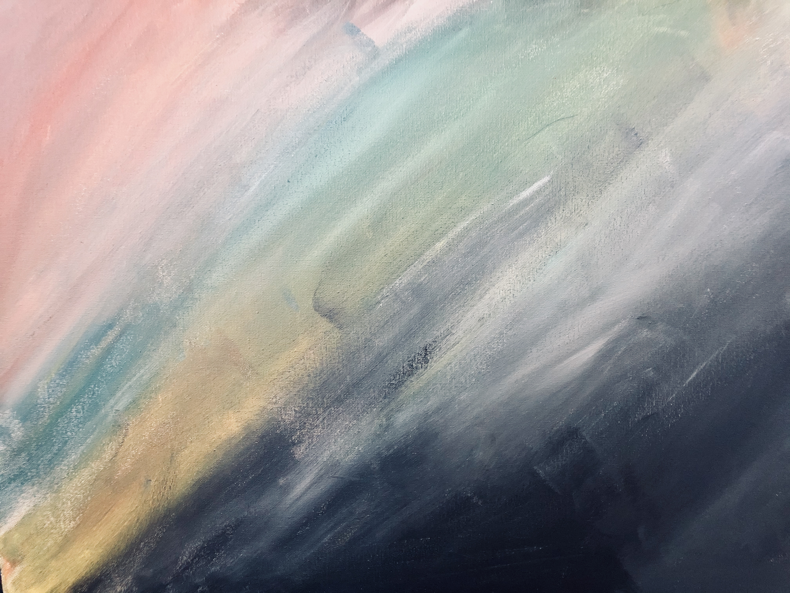

## A Mote of Dust Suspended in a Sunbeam

---

The inspiration for this painting came from Carl Sagen's famous quote:

> “Look again at that dot. That's here. That's home. That's us. On it everyone you love, everyone you know, everyone you ever heard of, every human being who ever was, lived out their lives. The aggregate of our joy and suffering, thousands of confident religions, ideologies, and economic doctrines, every hunter and forager, every hero and coward, every creator and destroyer of civilization, every king and peasant, every young couple in love, every mother and father, hopeful child, inventor and explorer, every teacher of morals, every corrupt politician, every "superstar," every "supreme leader," every saint and sinner in the history of our species lived there--on a mote of dust suspended in a sunbeam.”

The vastness of space juxtaposed against the tiny blue dot--barely visible. I think this is what Sagan meant with his quote; and why he expounded on the great many types of beings that have existed on this planet. It's that the entire world is nothing more than a speck, a seemingly insignificant blip of a signal to the background of ever present noise. It's despite this, despite the ever present noise that we focus so entirely on the day to day that is life. I think Sagan's quote wasn't meant to draw highlight to that pale blue dot, but rather expose the infinite space. We get stuck in our day to day habits, our ruts, our highs, our lows, but there's so much more to life than just those things that exist on Earth.
