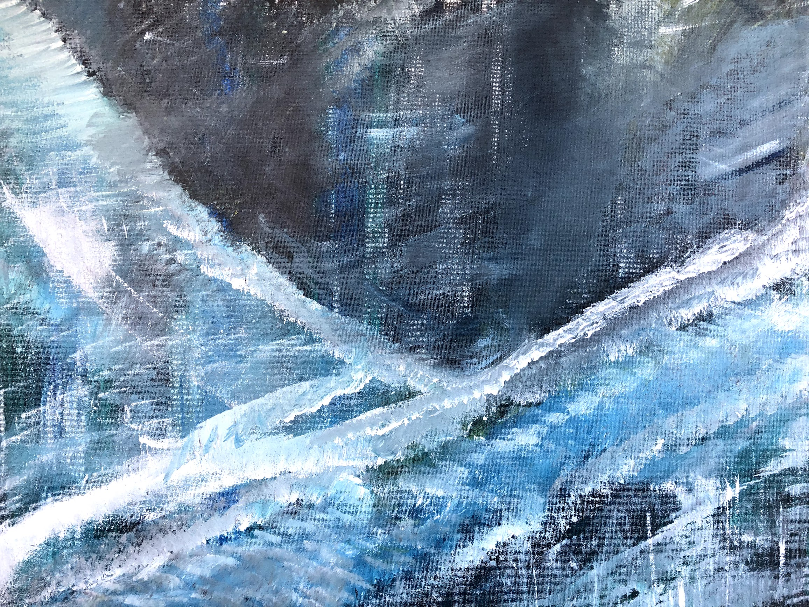

## Continuity of Complexity

---

This painting was inspired by the continuity of complexity that exists in all matter, and all things. I often think about the [Dunning-Kurger effect](https://en.wikipedia.org/wiki/Dunning%E2%80%93Kruger_effect) and what role it plays in my own life. Every time I explore a topic, I consider how shallow and over confident my first thought is; and as I become more well versed in the topic, I start to see the depth of my ignorance. It's a dizzying effect. There's is only ever one thing that you can be sure of when looking at a topic -- that it will only continue to grow more complex, the closer you look at it.
