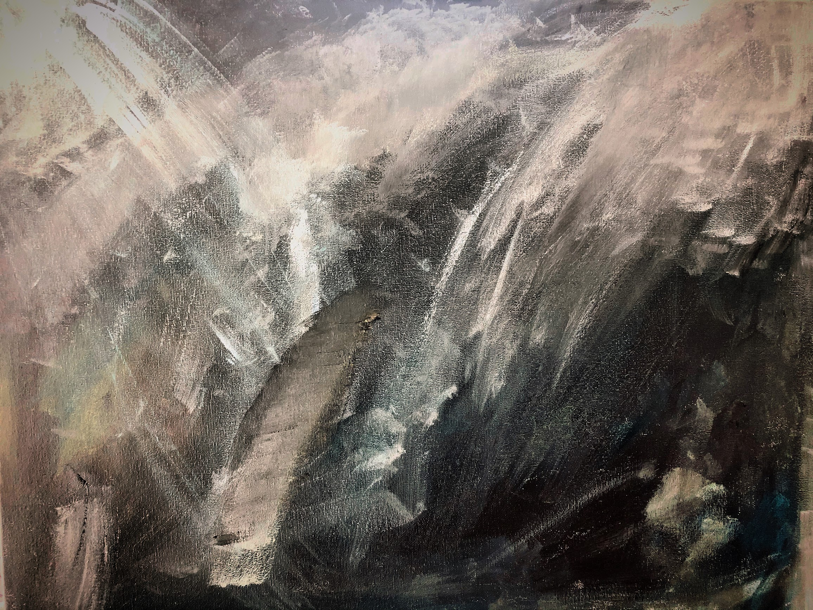

## The Light That Beckons

This was my first painting, I'll say, ever. I mean, I've painted with no real purpose as a kid but this time I actually put brush to canvas to try and explore a problem. That problem? Every decision redraws the course of your life. Regardless of where you believe in determinism or not, from a pure mathematical sense, a divergence occurs when a decision is made. For some people, myself included, getting stuck here happens. You stress about the decision you made, why you made it, and what it will bring. But, in thinking about this further (and why the figure seems to be undeterred by the beckoning lights), what matters is your reaction to these events; and, in particular, your attitude in your reaction. This is what it is to "find the humor in life".
